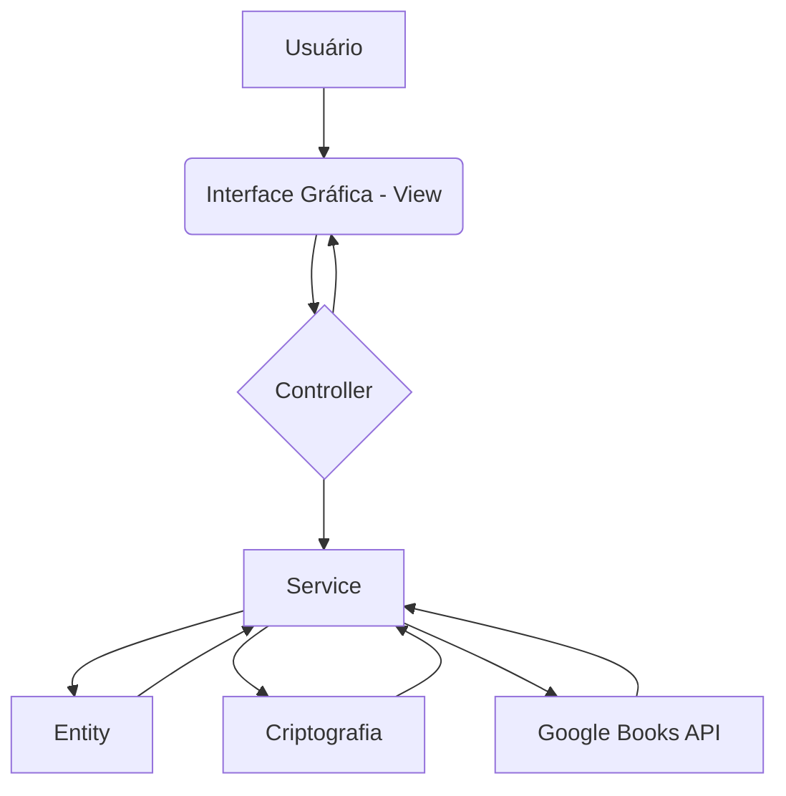
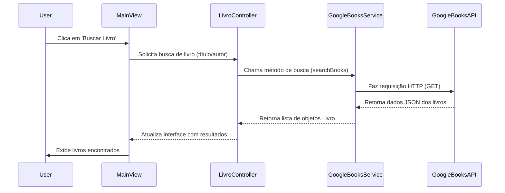

# Biblioteca em Java


Prepare-se para mergulhar no universo da **BibliotecaJava**, uma aplicação desktop que vai revolucionar a forma como você gerencia seus livros! Desenvolvida em **Java** com o poder do **Maven**, esta ferramenta não é apenas um sistema de biblioteca; é um portal para um mundo de conhecimento, com direito a **autenticação segura**, **gerenciamento de acervo** e uma integração mágica com a **Google Books API**!

## O Que Fazemos de Tão Legal? (Funcionalidades Incríveis!)

Nossa biblioteca digital é recheada de recursos que vão te deixar de queixo caído:

| Funcionalidade | Descrição Mágica |
| :--- | :--- |
| **Login Secreto** | Seus dados estão mais seguros que um tesouro pirata! Sistema de login e registro com senhas criptografadas usando o poderoso **jBCrypt**. |
| **Guardião dos Livros** | Adicione, edite, encontre e remova livros do seu acervo com a facilidade de um aceno de varinha. O CRUD (Criar, Ler, Atualizar, Deletar) de livros na palma da sua mão! |
| **Oráculo Literário** | Cansado de procurar? Nossa integração com a **Google Books API** permite que você busque livros por título, autor, ISBN e muito mais, trazendo informações valiosas diretamente para sua biblioteca! |
| **Organização Zen** | Mantenha seu acervo impecável! Organize seus livros por título, autor e categorias, transformando o caos em pura harmonia. |
| **Janelas para o Conhecimento** | Uma interface gráfica intuitiva e amigável, construída com **Java Swing**, para que sua jornada pela biblioteca seja tão agradável quanto ler um bom livro. |

## O Mapa da Mina (Arquitetura Desvendada)

Como toda grande aventura, a BibliotecaJava tem uma estrutura bem definida. Imagine um mapa onde cada parte tem uma função vital. Veja como a mágica acontece por trás dos panos:



### Os Blocos de Construção (Tecnologias)

Construímos nossa fortaleza literária com as melhores ferramentas do reino:

*   **Java 17+**: A linguagem que dá vida à nossa biblioteca. Rápida, robusta e confiável!
*   **Apache Maven**: Nosso mestre de obras, gerenciando todas as dependências e garantindo que tudo se encaixe perfeitamente.
*   **Java Swing**: A tela onde a história se desenrola, proporcionando uma experiência visual agradável.
*   **jBCrypt**: O guardião das senhas, garantindo que seus segredos estejam a salvo.
*   **Google Gson**: Nosso tradutor universal, convertendo dados JSON da Google Books API em informações que entendemos.
*   **Google Books API**: O oráculo que nos conecta a um universo infinito de livros.

### A Organização da Estante (Estrutura de Pacotes)

Cada livro em seu lugar! Nossa estrutura de pacotes é pensada para manter a ordem e a clareza:

*   `controller`: Os maestros que orquestram a interação entre você e o sistema. Aqui moram o `LivroController`, `UsuarioController` e o `SessionManager`.
*   `criptografia`: O cofre onde guardamos os segredos, com a classe `Senha` cuidando da segurança.
*   `entity`: Os personagens principais da nossa história: `Livro` e `Usuario`.
*   `enums`: Pequenos ajudantes que definem estados e tipos, mantendo a consistência.
*   `service`: Os heróis que realizam as tarefas mais complexas, como o `GoogleBooksService` que fala com o Oráculo Literário.
*   `view`: As janelas para o nosso mundo, onde você interage com o `LoginView` e a `MainView`.

## A Magia Acontece! (Fluxo da Google Books API)

Quer saber como a BibliotecaJava conversa com a Google Books API para encontrar seu próximo best-seller? É como mágica!



## Sua Jornada Começa Aqui! (Como Rodar o Projeto)

Pronto para embarcar nesta aventura? Siga estes passos:

### Pré-requisitos (Seu Kit de Aventureiro)

Antes de começar, certifique-se de ter:

*   **Java Development Kit (JDK) 17+**: A poção mágica para rodar o Java.
*   **Apache Maven**: A ferramenta essencial para construir nosso projeto.
*   **Chave da Google Books API (Opcional)**: O mapa do tesouro para acessar o Oráculo Literário. Você pode obtê-la [aqui](https://developers.google.com/books/docs/v1/getting_started).

### Guia de Instalação e Execução (Passo a Passo)

1.  **Teletransporte para o Repositório:**
    Abra seu terminal e clone o projeto:
    ```bash
    git clone https://github.com/GilvanPedro/BibliotecaJava.git
    cd BibliotecaJava/Biblioteca
    ```

2.  **Desvende o Segredo da API (Opcional):**
    Se você tem uma chave da Google Books API, insira-a no arquivo `GoogleBooksService.java` para desbloquear todo o poder do Oráculo Literário.

3.  **Construa a Fortaleza:**
    No diretório `BibliotecaJava/Biblioteca`, use o Maven para compilar:
    ```bash
    mvn clean install
    ```

4.  **Inicie a Aventura!**
    Após a compilação, o arquivo JAR estará no diretório `target/`. Execute-o para iniciar a aplicação:
    ```bash
    java -jar target/BibliotecaJava-1.0-SNAPSHOT.jar
    ```
    (O nome do arquivo JAR pode variar, então verifique o diretório `target/`!)

## Junte-se à Guilda! (Contribuição)

Quer fazer parte desta jornada? Suas contribuições são muito bem-vindas! Seja para relatar um bug (uma criatura estranha no código) ou sugerir uma nova funcionalidade (um novo feitiço!), sinta-se à vontade para abrir *issues* ou enviar *pull requests*.

## O Código de Honra (Licença)

Este projeto é regido pela **Licença MIT**. Para mais detalhes sobre seus direitos e deveres, consulte o arquivo [LICENSE](LICENSE).

_Feito com 💖 por Gilvan Pedro._
